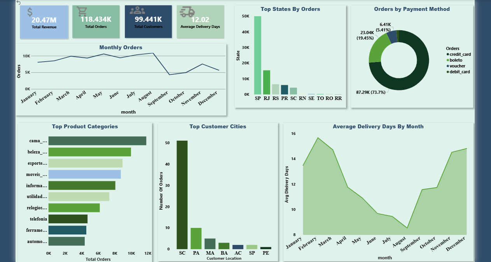

# 📊 E-Commerce Sales Dashboard

## Overview

This project presents an interactive Power BI dashboard built using the Brazilian E-Commerce (Olist) dataset.

The workflow started with cleaning and transforming the raw data using Python and Pandas in Jupyter Notebook. The processed dataset was then imported into Power BI to build an interactive dashboard that provides meaningful business insights.

The dashboard includes:

- Total Revenue
- Total Orders
- Total Customers
- Average Delivery Days
- Monthly Order Trends
- Orders by State
- Payment Methods
- Top Product Categories
- Top Customer Cities

---

## Tools Used

- Python 3.13
- Jupyter Notebook
- Pandas
- Power BI
- Power Query
- DAX

---

## Project Workflow

1. Collected the raw Brazilian E-Commerce dataset.
2. Cleaned and transformed the data using Python and Pandas.
3. Created new calculated fields for analysis.
4. Exported the processed dataset as CSV.
5. Imported the cleaned dataset into Power BI.
6. Built DAX measures and designed an interactive dashboard.

---

## Dashboard Preview

---

## Key Skills Demonstrated

- Data Cleaning & Preprocessing
- Data Transformation
- Data Modeling
- Data Visualization
- Dashboard Design
- DAX Measures
- Business Intelligence

---

## Dataset

Brazilian E-Commerce Public Dataset (Olist)

---

## Data Source

The dataset used in this project is the Brazilian E-Commerce Public Dataset by Olist.

Source: [Kaggle - Brazilian E-Commerce Public Dataset by Olist](https://www.kaggle.com/datasets/olistbr/brazilian-ecommerce)
